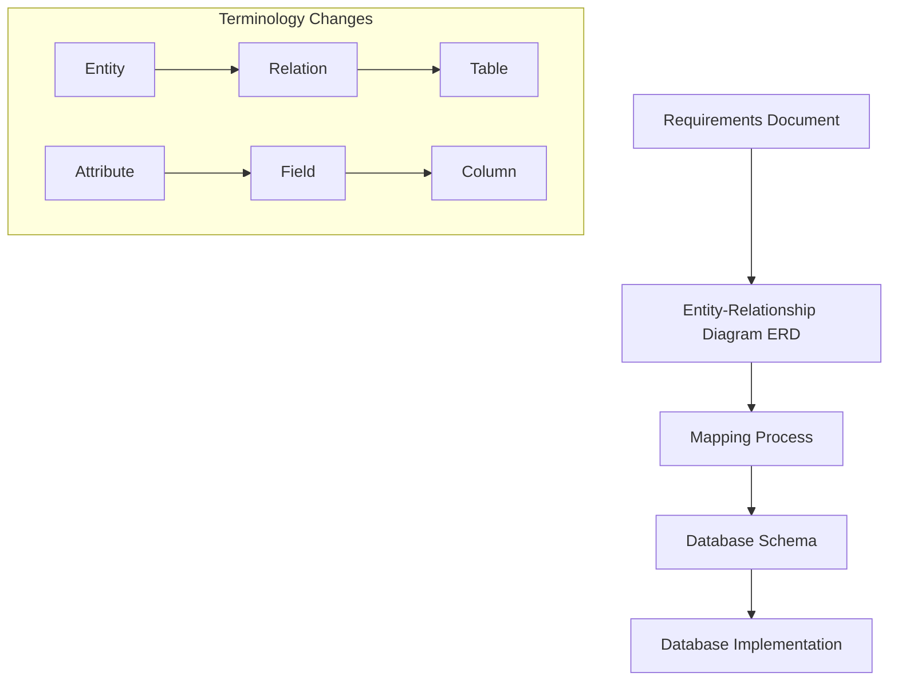

# Database Design: From Requirements to Implementation

## 1. Requirements Analysis
The process begins with analyzing the requirements document. This stage involves understanding the business needs and data relationships.

## 2. Entity-Relationship Diagram (ERD)
Based on the requirements, an ERD is created. This is a visual representation of the data structures and their relationships.

### Key Points:
- ERDs can vary based on individual interpretation of requirements
- In an ERD:
  - Data objects are called "entities"
  - Characteristics of entities are called "attributes"

## 3. Mapping ERD to Relational Schema
The ERD is then mapped to a relational schema. This process follows specific rules, ensuring that a single ERD typically results in a single database schema.

### Terminology Changes:
| ERD Term | Schema Term | Database Term |
|----------|-------------|----------------|
| Entity   | Relation    | Table          |
| Attribute| Field       | Column         |

## 4. Database Schema
The schema is the blueprint for the database structure.

## 5. Database Implementation
The final step is implementing the schema in a database management system.

### Key Concepts:
- A **row** (also called a record or tuple) represents a specific instance of an entity
- A **database** is a collection of tables
- A **relational database** contains tables with defined relationships between them

## Example: Employee and Department
In a relational database, you might have:
- An "Employees" table
- A "Departments" table
- A relationship allowing you to associate an employee with a specific department

## Visual Representation

This diagram illustrates the flow from requirements to implementation, as well as the terminology changes across different stages of database design.
