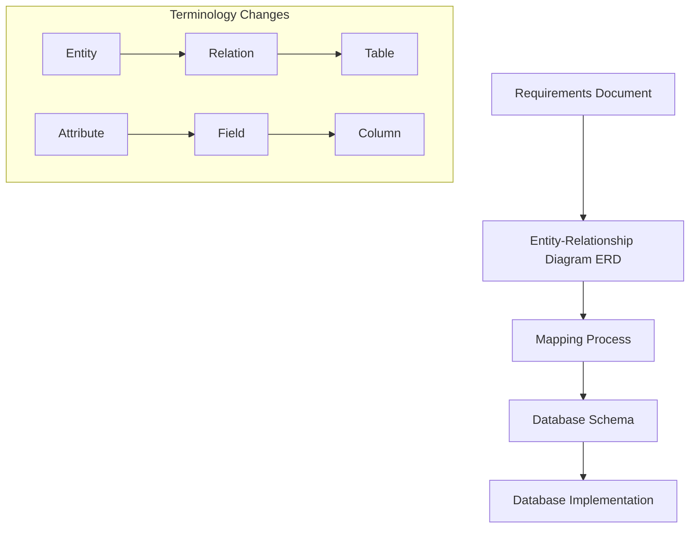
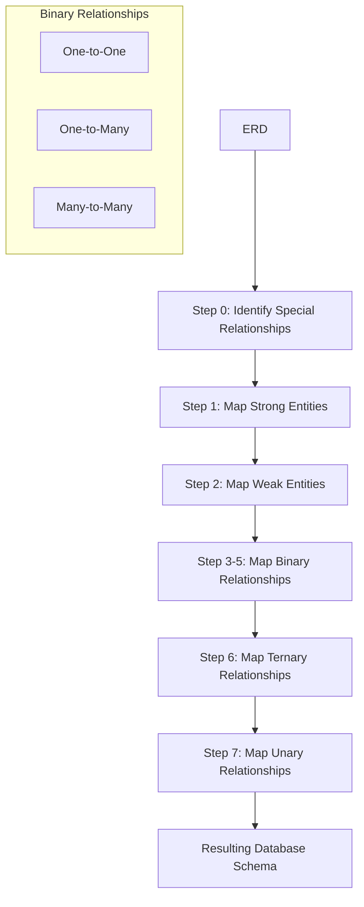
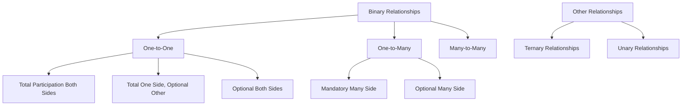
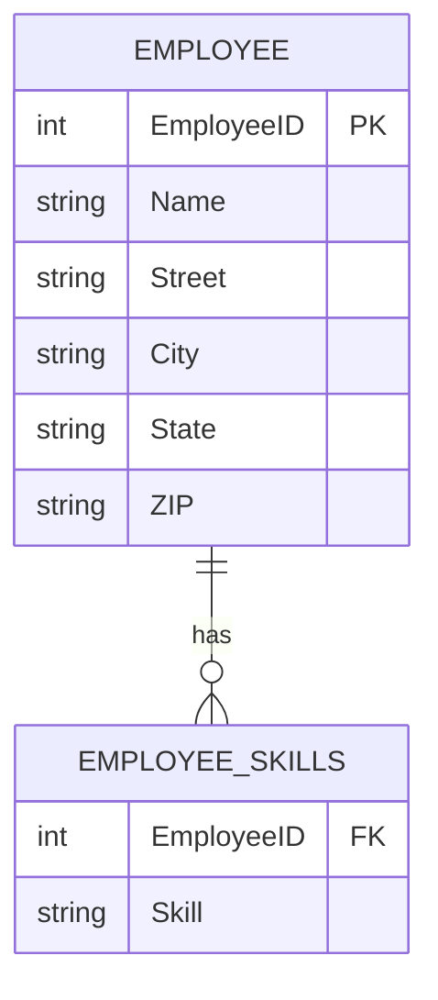

# Database Design: From Requirements to Implementation

## 1. Requirements Analysis
The process begins with analyzing the requirements document. This stage involves understanding the business needs and data relationships.

## 2. Entity-Relationship Diagram (ERD)
Based on the requirements, an ERD is created. This is a visual representation of the data structures and their relationships.

### Key Points:
- ERDs can vary based on individual interpretation of requirements
- In an ERD:
  - Data objects are called "entities"
  - Characteristics of entities are called "attributes"

## 3. Mapping ERD to Relational Schema
The ERD is then mapped to a relational schema. This process follows specific rules, ensuring that a single ERD typically results in a single database schema.

### Terminology Changes:
| ERD Term | Schema Term | Database Term |
|----------|-------------|----------------|
| Entity   | Relation    | Table          |
| Attribute| Field       | Column         |

## 4. Database Schema
The schema is the blueprint for the database structure.

## 5. Database Implementation
The final step is implementing the schema in a database management system.

### Key Concepts:
- A **row** (also called a record or tuple) represents a specific instance of an entity
- A **database** is a collection of tables
- A **relational database** contains tables with defined relationships between them

## Example: Employee and Department
In a relational database, you might have:
- An "Employees" table
- A "Departments" table
- A relationship allowing you to associate an employee with a specific department

## Visual Representation

This diagram illustrates the flow from requirements to implementation, as well as the terminology changes across different stages of database design.

## 6. Physical Design: Mapping ERD to Schema

After creating the Entity-Relationship Diagram (ERD), the next crucial step is mapping it to a database schema. This process follows specific rules established by database design experts to optimize the schema and address common issues like null values and data duplication.

### Key Concept: Null Values
Null values in databases represent reserved but unused memory space. Proper schema design aims to minimize null occurrences.

### Mapping Process Steps

#### Step 0: Identify Special Relationships
Before the main mapping steps, identify one-to-one binary relationships with total participation. These will be mapped first.

#### Step 1: Mapping Regular Strong Entities
Convert primary entities from the ERD into database tables.

#### Step 2: Mapping Weak Entities
Transform weak entities, considering their dependency on strong entities.

#### Steps 3, 4, 5: Mapping Binary Relationships
3. Map one-to-one relationships
4. Map one-to-many relationships
5. Map many-to-many relationships

#### Step 6: Mapping Ternary Relationships
Handle relationships involving three entities.

#### Step 7: Mapping Unary Relationships
Address relationships where an entity is related to itself.

### Visual Representation of Mapping Process

This diagram illustrates the step-by-step process of mapping an ERD to a database schema, highlighting the order and types of relationships addressed.

## Conclusion

The process of moving from an ERD to a physical database design requires careful consideration of entity types, relationships, and design principles. By following these steps, database designers can create efficient schemas that minimize data redundancy and null values while accurately representing the required data structures and relationships.

[Note: Further details on each mapping step can be added as you provide more specific information about the mapping rules and techniques.]

## 6. Physical Design: Mapping ERD to Schema

### Mapping Process Steps

#### Step 0: Identify Special Relationships
Before the main mapping steps, identify one-to-one binary relationships with total participation. These will be mapped first.

#### Step 1: Mapping Regular Strong Entities
Convert primary entities from the ERD into database tables.

Example:
- Strong Entity: Customer
- Attributes: Customer ID (Primary Key), Customer Name, Address
- Resulting Relation: CUSTOMER(CustomerID, CustomerName, Address)

##### Handling Different Attribute Types:
1. Simple Attributes: Mapped directly to columns.
2. Composite Attributes: Each component becomes a separate column.
   Example: Address (Street, City, State, ZIP)
3. Multivalued Attributes: Create a separate relation with a foreign key.
   Example: Employee Skills

#### Step 2: Mapping Weak Entities
Transform weak entities, considering their dependency on strong entities.

#### Steps 3, 4, 5: Mapping Binary Relationships

##### One-to-One Relationships (3 scenarios):
1. Total participation on both sides (Step 0)
2. Total participation on one side, optional on the other
3. Optional participation on both sides

##### One-to-Many Relationships (2 scenarios):
Focus on the "many" side, which can be:
1. Mandatory (total participation)
2. Optional (partial participation)

##### Many-to-Many Relationships:
Only one scenario, typically requiring a junction table.

#### Step 6: Mapping Ternary Relationships
Handle relationships involving three entities.

#### Step 7: Mapping Unary Relationships
Address relationships where an entity is related to itself.

### Visual Representation of Relationship Types

This diagram illustrates the different types of relationships and their scenarios in the mapping process.

### Example: Mapping a Strong Entity with Various Attribute Types

This diagram shows how a strong entity (Employee) with a composite attribute (Address) and a multivalued attribute (Skills) is mapped to relations.

## Conclusion

The process of mapping an ERD to a database schema involves careful consideration of entity types, relationship cardinalities, and attribute characteristics. By following these steps and understanding the different scenarios for each type of relationship, database designers can create efficient and accurate schemas that properly represent the data model.

[Note: Further examples and specific mapping rules can be added for each step as needed.]
